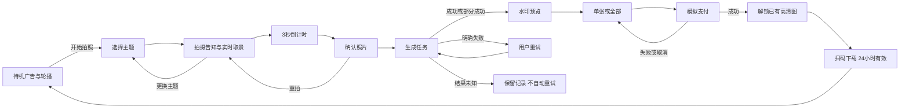

# AI 拍照亭 · 功能与演示清单

## 产品目标
当前 Windows 内置摄像头，自助拍照 → 云端风格生成 → 水印预览 → 模拟购买 → 同 Wi-Fi 手机下载。视觉采用大图、少文案和大按钮的触屏拍照机。第一轮不接真实支付、不部署公网、不做本地 AI。

## 三类页面
| 页面 | 面向谁 | 功能 |
|---|---|---|
| / | 现场体验者 | 风格、摄像头、确认、等待、结果、模拟购买、取图 |
| /admin | 本机操作员 | 查看 API 配置状态、风格提示词、示例图、任务与订单记录 |
| /pickup/:token | 手机用户 | 仅查看本链接已解锁的图片，下载，查看有效期 |

## 状态与边界
- 未配置 API：默认演示模式，图片仅进行确定性的演示排版或效果处理，明确非 AI 成片。
- 真正 Seedream 模式：后台密钥 + 模型标识配置后才能调用，错误不回退演示模式。
- 摄像头权限拒绝、设备占用：显示恢复提示，也允许手动上传授权使用的测试照片。
- 本地浏览器刷新：查询持久化的任务；不将原始照片存 localStorage。
- 生成中重复点击：不重复发起；超时、服务重启导致结果未知时，不自动再次计费。
- 部分成功：显示实际图片数，只有一张时全部价格同单张。
- 已付模拟订单不可倒退状态；单张购买不能下载其他高清图。
- 闲置退出清除屏幕状态，旧任务不覆盖下一位；已购手机链接仍有效。
- 到期图片清理由服务定期执行，关机期间不执行，重启后补清理。

## 每阶段演示
1. 此文档 + `/stages.html`：浏览流程、范围与目录。
2. 应用首页、管理页：确认服务与 API 配置状态。
3. 演示模式：真实摄像头/授权上传 + 全流程页面 + 明确标注的非 AI 演示结果。
4. API 接入代码与三套提示词；真实样片需要密钥、照片授权和预算后验证。
5. 模拟购买后二维码 + 手机页面；必须同 Wi-Fi 实测后才算手机验收。
6. 测试报告和使用说明；区分自动化验证、浏览器预览与人工硬件验收。
