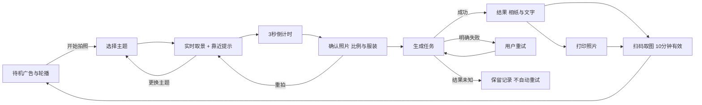

# AI 拍照亭 · 功能与演示清单

## 产品目标
现场设备（Mac + 外接摄像头 + 照片打印机）自助拍照 → 云端 AI 生成 → 相纸编辑与打印 → 同 Wi-Fi 手机取图。程序内不设付款环节，收费由现场在使用前完成。视觉采用大图、少文案和大按钮的触屏拍照机。不部署公网、不做本地 AI。

## 三类页面
| 页面 | 面向谁 | 功能 |
|---|---|---|
| / | 现场体验者 | 主题、拍照、确认、等待、结果、相纸、打印、取图 |
| /admin | 本机操作员 | 生图服务配置、主题提示词与封面、摄像头、打印机、测试模式、任务记录 |
| /pickup/:token | 手机用户 | 仅查看本次体验的 AI 成片与拍摄原片，下载，查看有效期 |

## 状态与边界
- 未配置 API：页面可以打开，生成按钮等待配置；不会用模拟图片冒充 AI 成片。
- 模式切换：工作台只有“运营模式”和“测试模式”，默认运营模式。运营模式顾客端不显示任何测试内容；测试模式显示测试照片入口并本机模拟出图。
- 摄像头权限拒绝、设备占用：显示恢复提示，也允许上传授权使用的照片。
- 拍照提示：取景画面和右侧提示框提醒“离摄像头约一米，让头顶到腰部都在画面里”，减少 AI 凭空补画肢体。
- 本地浏览器刷新：查询持久化的任务；不将原始照片存 localStorage。
- 生成中重复点击：不重复发起；超时、服务重启导致结果未知时，不自动再次调用。
- 打印：点击后显示“正在打印”，重复点击和刷新不重复出纸。
- 闲置退出清除屏幕状态，旧任务不覆盖下一位；有效期内手机取图链接仍有效。
- 到期图片由服务每秒清理，关机期间不执行，重启后补清理。

## 每阶段演示
1. 此文档 + `/stages`（仅测试模式可访问）：浏览流程、范围与目录。
2. 应用首页、工作台：确认服务、API 与打印机配置状态。
3. 测试模式：真实摄像头/授权上传 + 全流程页面 + 明确标注的非 AI 模拟结果。
4. 提示词 + Seedream API：真实样片需要密钥、照片授权和预算后验证。
5. 打印与手机取图：实体出纸和同 Wi-Fi 手机保存必须现场实测后才算验收。
6. 测试报告和使用说明；区分自动化验证、浏览器预览与人工硬件验收。
