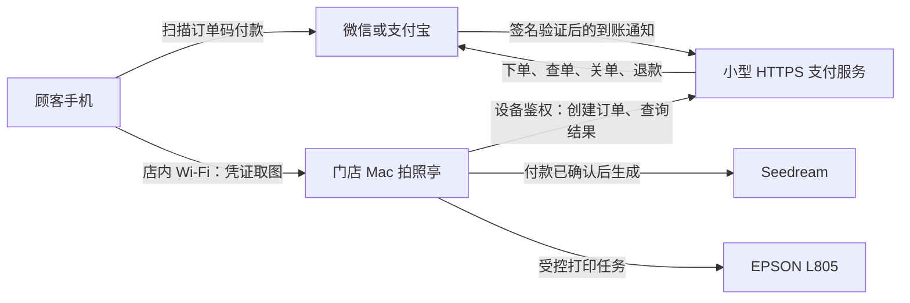

# 无人值守拍照亭：客户对接方案

日期：2026-09-30。目标：中国大陆门店，Mac 无人值守，自助支付、AI 生图、自动打印，手机连接店内 Wi-Fi 取图。本文是接入方案；真实支付与自动打印尚未实现。

## 推荐首版

沿用现有 Mac、UGREEN 摄像头、EPSON L805 和应用。先接通客户已经具备接口权限的一个支付渠道，完成营业闭环，再增加另一个渠道。

- 微信方案：屏幕显示每笔订单独立的二维码，顾客使用微信扫码支付；接入产品为 **Native 支付**。
- 支付宝备选：申请/核实**当面付的扫码支付能力**，开发侧使用预创建订单接口 `alipay.trade.precreate`。不能仅凭支付宝商家身份或静态收款码判断可接入；须由客户后台或官方客服确认接口权限。
- 不新增扫码枪。这里是顾客扫设备屏幕上的码，不是设备扫顾客付款码。
- 首版只做店内 Wi-Fi 取图；不建设公网照片库。支付本身仍需要互联网，不能离线收款。

建议把收费放在生图之前，避免顾客反复免费生成。流程建议为：选主题 → 拍照并确认 → 显示商品内容和价格 → 扫码支付 → 服务端确认到账 → AI 生图 → 相纸编辑与打印确认 → 自动打印，同时显示取图码。价格、每单份数和此收费顺序待客户确认，当前程序尚未修改。

## 为什么不能直接放一张收款码

系统必须确定哪一笔订单、什么金额已经付款，才能自动开始生成和打印。顾客说“已付款”、上传支付截图或点击“确认取图”，都不能作为到账依据。

普通静态收款码不直接提供本方案所需的订单关联与接口授权。若客户只有银行/收单机构提供的聚合收款码，应联系该机构确认是否提供正式的动态订单、查单、到账通知、关单和退款 API。若是服务商子商户，使用该服务商授权方案，不能套用普通直连商户参数。

## 部署结构



支付服务部署在稳定的服务器上，保存订单、支付流水和退款状态。资金由支付平台结算到客户商户账户；应用不代客户收款。支付私钥留在服务端，Mac 使用独立设备凭据，只能操作本设备订单。顾客照片不进入支付服务，仍由 Mac 与现有生图服务处理。

Mac 主动查询支付结果，店内不需要公网 IP、不做路由器端口转发，也不把后台暴露到公网。选用已有可用的 HTTPS 主机/域名最省时间；如需新购或备案，由客户明确主体和预算。大陆云部署的域名备案及渠道要求按实际服务核实，不承诺当天开通。

## 现在发给客户的文字

> 为接通无人值守自动收款和打印，请先帮忙确认以下信息，不需要发送密码或密钥：
>
> 1. 哪个账户收款、商户主体是什么？是直接在微信/支付宝申请的商户，还是银行/服务商的子商户？
> 2. 微信商户平台是否已开通 **Native 支付**？是否有已认证且与商户号绑定的 APPID？可以回复“已开通/未开通/不清楚”。
> 3. 支付宝是否已签约 **当面付扫码支付**，并有能调用接口的开放平台应用？如不清楚，请让商户管理员或收单服务商确认。
> 4. 哪个渠道能先提供开发接入权限，就先上线哪个。请指定一位能登录商户后台、配合授权的负责人。可提供隐藏敏感信息后的权限页面截图，暂时不用发送任何私钥。
> 5. 每单售卖什么：几张纸质照片、是否包含电子图、售价多少？是否接受付款后生成，明确失败退款？打印失败而电子图已交付时，如何退款或补打？
> 6. 打印机是否仍是 EPSON L805？请看一下当前相纸包装上的尺寸、纸型。建议首版固定一种纸张规格，并采用留白适配以保留人脸、相纸边框和文字；如要铺满裁切请明确。
> 7. 是否有可复用的云服务器和已备案域名？没有也可以，我们再单独确认采购方案。请确认店内 Wi-Fi 能让顾客手机访问这台 Mac，并确定故障联系负责人。

## 确认渠道后再配置的技术资料

| 渠道 | 客户负责确认 | 开发配置阶段处理 |
| --- | --- | --- |
| 微信直连 Native | 商户主体及商户号、Native 权限、合规且已认证的 APPID、APPID 与商户号绑定、技术负责人权限 | 商户 API 证书序列号与对应私钥、API v3 密钥、微信支付公钥及 ID 或平台证书方案、HTTPS 通知地址；具体按账户当前配置核实 |
| 支付宝直连扫码 | 当面付扫码权限、开放平台应用 APPID、应用状态和商户关系 | 应用私钥、公钥/证书配置、支付宝验签材料、通知地址、查单及退款权限；具体按官方接入模式核实 |
| 服务商/聚合支付 | 服务商名称、子商户身份、正式 API 文档、应用授权、查单/退款权限与费用 | 按服务商签约文档接入，不拿静态收款二维码模拟自动到账 |

密钥通过受控的服务器配置或安全交接渠道配置，不放聊天、Git、浏览器前端、诊断报告。前期只需确认“有没有、能否授权”，不要求客户把整套技术参数一次收集齐。

## 打印参数能自动获取到什么

| 信息 | 能否自动读取 | 如何解读 |
| --- | --- | --- |
| 已安装队列、默认队列、接受任务状态 | 通常可以，使用 macOS CUPS 命令 | 表示系统配置和当前队列状态，不证明纸已打印出来 |
| 驱动型号 | 传统 PPD 可读时可以；免驱队列可能无此文件 | 读不到应报告未知，不能擅自安装驱动 |
| 支持的纸张、介质、无边距、质量等选项 | `lpoptions -p 队列 -l`，以实际驱动返回为准 | 不同驱动返回能力不同，不能预设某个选项一定存在 |
| 当前默认纸张/选项 | 驱动列出的星号选项 | 默认 A4 不代表纸盒里装了 A4 |
| 实际装纸尺寸、剩余张数、实际纸型 | 不能可靠从普通队列获得 | 请客户看包装/纸盒；不用懂代码 |
| 每单份数、售价、裁切或留白 | 无法自动推定 | 属于营业规则，需要客户决定 |

开发侧提供了 [只读采集脚本](../scripts/macos/printer-diagnostics.mjs)，已接入 Mac 菜单 4。客户需先按 [Mac 更新步骤](../README-Mac.md#后续更新) 更新程序；首次采集前确认脚本已存在，旧版菜单 4 只读取简单队列状态。

若手动传送该脚本到客户现有项目的 `scripts/macos/printer-diagnostics.mjs`，可以独立采集，无须更新或重启业务服务：

```bash
cd "$HOME/Applications/ai-photo-booth"
./runtime/bin/node scripts/macos/printer-diagnostics.mjs
```

输出为该目录下 `diagnostics/mac-printers-<时间>.txt`。脚本仅调用只读查询；不出纸、不改变纸张或队列设置，也不读取打印历史、顾客照片、订单或 `.env`。报告可能包含队列/驱动名称，请只发送给项目开发人员。Windows 已验证报告逻辑，目标 Mac 的真实输出仍待采集。

## 可直接复制给 Mac 上 AI 的任务

```text
请在当前 Mac 采集 AI 拍照亭的打印接入参数，仅检查并生成报告，不打印、不改设置。

1. 确认系统是 macOS，项目为 $HOME/Applications/ai-photo-booth；不要升级、覆盖或重启正在运行的应用。
2. 如 scripts/macos/printer-diagnostics.mjs 已由开发者提供，在项目目录使用 ./runtime/bin/node 运行它，读取生成的 diagnostics/mac-printers-*.txt。
3. 若脚本尚未提供，不需要更新仓库：用 LC_ALL=C /usr/bin/lpstat -p -d 和 LC_ALL=C /usr/bin/lpstat -a 读取队列；从真实输出中逐一提取队列名，然后用 LC_ALL=C /usr/bin/lpoptions -p "已读取的队列名" -l 采集支持的选项。不要猜队列名，不使用 lp/lpr 提交打印，不执行任何 lpoptions -o/-d 设置操作。每个查询超时或失败后记录错误，不循环重试。
4. 能读取 /etc/cups/ppd/<已确认队列名>.ppd 时，只摘取 Manufacturer、ModelName、NickName、Product；文件不存在或无权限就报告未知，不使用 sudo。不要输出完整 PPD、设备 URI 或打印历史。
5. 在项目 diagnostics/ 中保存带时间的文本报告，分列队列状态、驱动、支持纸张、默认纸张、无边距/介质/质量相关选项。未返回的字段写“未获取”，不要编造打印能力。
6. 明确区分驱动支持的纸张、默认设置和实际装入的相纸。请现场人员只补充：相纸包装上的尺寸/纸型、每单张数、裁切还是留白。不要把默认配置当成实物确认。
7. 将报告路径和摘要返回开发者；不要发送照片、订单、.env、密钥，不消耗纸墨，不安装驱动或新软件。
```

## 交付与上线验收

开发侧依次完成真实支付、打印队列、订单恢复和营业模式。新开单前检查设备状态；已付款任务有明确失败/退款/待处理状态。重复支付通知、重启和顾客多次点击不能重复生图或出纸。

客户只需配合权限开通、实物装纸和现场验收。正式切换前至少验证：真实支付成功与取消、生成成功与失败、实体出纸、缺纸和打印机离线、进程重启、支付通知延迟，以及店内手机扫码保存。系统队列显示完成仍需核对实体出纸；若驱动无法可靠反馈异常，应在方案中明确检测限制和远程处理方式。

不以“安装成功”或“接口模拟通过”作为营业验收。商户审核、打印驱动能力和现场验证尚不确定，因此现在不能负责任地给出固定上线日；客户返回权限和打印报告后，才能确定最终排期。

## 官方依据与核验范围

- [微信 Native 产品介绍](https://pay.weixin.qq.com/doc/v3/merchant/4012791874)：2026-09-30 直接读取官方正文，确认商户下单获取 `code_url`、设备展示二维码、顾客微信扫码支付的模式与主体/应用要求。
- [微信 Native 开发接入准备](https://pay.weixin.qq.com/doc/v3/merchant/4015614538)：2026-09-30 直接读取官方正文；页面标注更新于 2026-09-18，明确已有商户号仍需申请 Native 权限、完成已认证 APPID 的授权绑定并配置技术负责人。
- [支付宝开放平台](https://open.alipay.com/) / [支付宝文档中心](https://opendocs.alipay.com/)：本次文档请求只返回动态网页外壳，未取得相关产品正文。本文支付宝方案为待核验候选；签约条件、应用模式、费率与权限由客户后台和官方客服确认后再实施。
- 支付费率按客户合同；云主机/域名、AI 调用、纸墨和维护分别计成本，本轮未购买任何服务。
